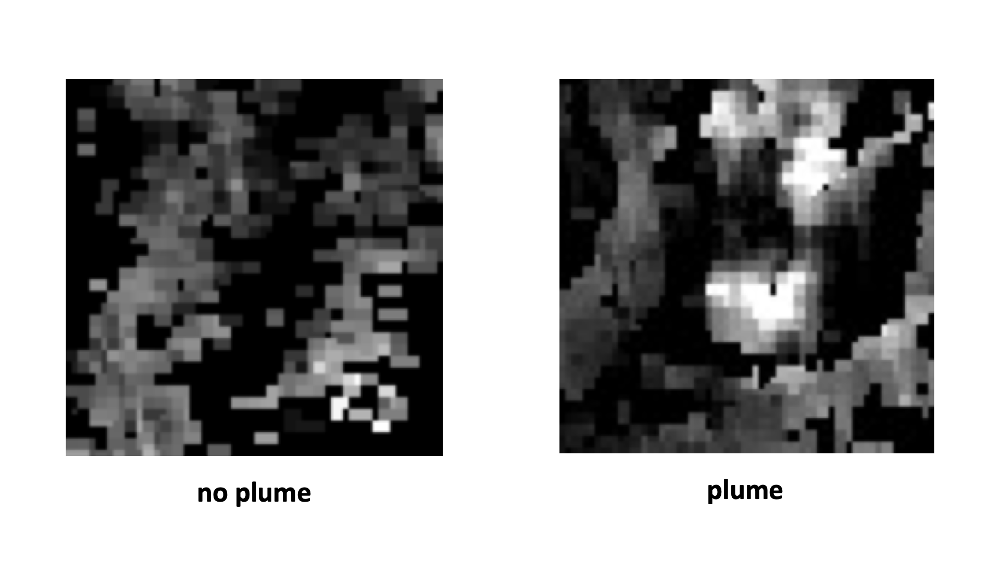
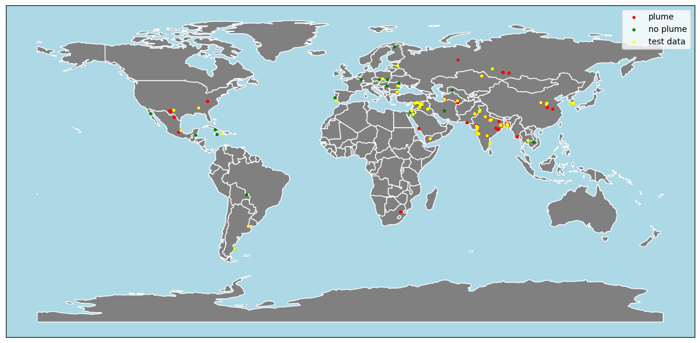

# Methane Emission Project

Authors: Alvaro Calafell, João Melo, Steve Moses, Harshit Shangari, Thomas Schneider & Maria Stoelben

## Data
The data consists of satellite images of different locations. There are 428 annotated images and 108 test images. The data is labeled with whether a location contains a methane plume or not. The image size is 64 x 64 pixels with one channel, i.e. grayscale images. Additionally, metadata of the images was provided, incl. longitude, latitude, date and coordinates of the plume. Below example images from the data as well as the geographical locations are displayed.

<p float="left">
  
   
</p>

## Data Augmentation
We use different geometric transformations such as random cropping, rotations, horizontal and vertical flips as well as adjust the sharpness and contrast of the original images to create new augmented images for the training data. Finally, we normalize all our images. For the validation data, the images are only resized and cropped depending on the input requirement of the model we use and normalized in the end.

## Setup
Create a virtual environment:

```bash
python3 -m venv .venv
source .venv/bin/activate
```

To install requirements:

```bash
pip install -r requirements.in
```

It is assumed that the user has the data and stored it in the root directory of the repo as indicated below:

    .
    ├── ...
    └── data                  
        ├── test_data
        │   ├── images    
        │   │   └── ...      
        │   └── metadata.csv          
        └── train_data
            ├── images    
            │   ├── no_plume   
            │   │   └── ... 
            │   └── plume  
            │       └── ...     
            └── metadata.csv 


## Run Training
```bash
python train.py
```

## Run Inference
```bash
python inference.py
```

## Run the App
```bash
cd Web_app_scripts
streamlit run first.py
```

## Results
The image classification was trained on a 5-fold cross validation split with batch size 32 (after data augmentation). Each fold runs for 10 epochs with an SGD optimizer with momentum and decay.

Model | Weigths | Avg. Val AUC | Test AUC
--- | --- | --- | ---
Baseline CNN | - | 0.86 | -
ResNet18 | IMAGENET1K_V1 | 0.96 | 0.96
DenseNet-121 | IMAGENET1K_V1 | 0.95 | -
Swin-T | IMAGENET1K_V1 | 0.95 | -
VGG19-BN | IMAGENET1K_V1 | 0.94 | -
ResNet50 | IMAGENET1K_V2 | 0.91 | -

For the final submissions the best model (ResNet18) was fine tuned on the whole dataset. The right number of epochs was inferred by the validation results from the previous step.
